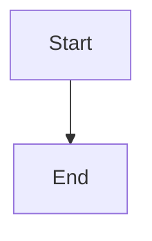
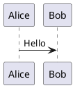

# Druckform

Convert Markdown with composable components into styled PDFs via LaTeX. Two binaries: `druck` (CLI) and a druckform MCP server (used by Claude Code).

## MCP Tools

| Tool | Parameters | Returns |
|------|-----------|---------|
| `list_templates` | — | `{ schemaVersion: "1", templates: [{ name, extends, origin, description }] }` |
| `list_components` | `template: string` | `{ schemaVersion: "1", template, components: [{ name, description, params, acceptsChildren, example }] }` |
| `render_document` | `template: string, style: string` | `{ job_id, upload_url, download_url, expires_at, manifest_spec }` |
| `render_markdown` | `document: string, template?, style?` | `{ job_id, download_url, expires_at }` or `{ status: "error", error }` |
| `preview_component` | `template: string, name: string, params?, children?` | `{ job_id, download_url, expires_at }` or `{ status: "error", error }` — quickly preview one `:::` component with sample params; defaults to the component's `meta.example` when params/children are omitted |
| `validate_document` | `job_id: string` | `{ schemaVersion: "1", ok: bool, findings: [{ severity, component, message, line? }] }` |
| `finalize_job` | `job_id: string` | `{ status: "ok", download_url }` or `{ status: "error", error: { summary, findings } }` |
| `list_job_files` | `job_id: string` | `{ job_id, files: [{ name, size, checksum }] }` |
| `refresh_job` | `job_id: string` | `{ job_id, upload_url, download_url, expires_at }` |
| `delete_job` | `job_id: string` | `{ status: "deleted", job_id }` |

**Edit loop (delta uploads):** a job persists, so to re-render after a tweak: `list_job_files` (get checksums) → diff locally → `refresh_job` (fresh URLs) → upload a zip of only the changed files (it merges over the job dir; unchanged assets are reused) → `finalize_job`. `delete_job` cleans up.

**Asset-less documents:** prefer `render_markdown({ document })` — it renders inline Markdown text to PDF with no ZIP and no upload, returning a `download_url` directly. `template`/`style` are optional (template may come from frontmatter, style from the template). Use the `render_document` → upload → `finalize_job` flow below only when you have assets (images, `.puml` skins).

## Workflow

Always follow this sequence:

1. **Discover** — call `list_templates`, then `list_components` for the chosen template. Read every component's `example` field to understand syntax and required params.

2. **Call `render_document`** with the chosen template name and the style path within the zip (e.g. `"style.yaml"`). Returns `job_id`, `upload_url`, `download_url`.

3. **Build and upload the ZIP bundle**:
   ```bash
   # Assemble the bundle in a temp directory
   mkdir /tmp/druckform-bundle
   cp document.md /tmp/druckform-bundle/
   cp style.yaml /tmp/druckform-bundle/
   cp -r assets/ /tmp/druckform-bundle/assets/ 2>/dev/null || true
   cd /tmp/druckform-bundle && zip -r /tmp/bundle.zip .
   # Upload
   curl -X PUT -H "Content-Type: application/octet-stream" \
     --data-binary @/tmp/bundle.zip \
     "<upload_url>"
   ```

4. **Validate** (recommended before finalize):
   Call `validate_document(job_id)` — if `ok` is false, fix the document and re-upload (start a new `render_document` job).

5. **Finalize** — call `finalize_job(job_id)`. On `status: "ok"`, use the returned `download_url`.

6. **Download**:
   ```bash
   curl -o output.pdf "<download_url>"
   ```

**Important:** The `upload_url` and `download_url` expire in 15 minutes. Keep the workflow contiguous. Each URL is single-use.

## Document Format

A document may begin with an optional `---` YAML frontmatter block, followed by standard Markdown plus component directives using `:::` fences:

```markdown
---
title: Q3 Review
author: A. Hacker
---

# Document Title

Normal Markdown: **bold**, *italic*, lists, tables, code blocks.

::: component-name param="value" other-param="value"
Children content (Markdown, may contain nested components)
:::
```

Frontmatter values are available to components (e.g. a title block). A template may declare which frontmatter fields it accepts (and which are required) — `validate_document` reports missing required fields. (For the MCP flow, still pass `template` to `render_document` explicitly.)

Components can be nested:

```markdown
::: infobox title="Outer"
Text here.
::: infobox title="Inner"
Nested content.
:::
:::
```

Call `list_components` to get each component's exact parameter names, types, required status, and a working example.

## Diagrams

Include Mermaid or PlantUML diagrams as fenced code blocks — they are pre-rendered to PDF automatically:

````markdown

````

````markdown

````

Place any `.puml` skin files in `assets/` and reference them in `style.yaml` via `diagrams.plantuml.skinRef`.

## ZIP Bundle Layout

```
bundle.zip
├── document.md       # required — the source document
├── style.yaml        # required — path passed as `style` arg to render_document
└── assets/           # optional
    ├── logo.png
    └── skin.puml
```

The `style` parameter to `render_document` is the path to the YAML file within the ZIP (relative to the ZIP root). Example: pass `"style.yaml"` if the file is at the root; `"styles/corporate.yaml"` if nested.

## Style File (style.yaml)

```yaml
$schema: "style-v1"
tokens:
  colors:
    accent:    "#2E5AAC"   # hex only, #RRGGBB
    warning:   "#B26A00"
    infoboxBg: "#EEF3FB"
  fonts:
    main: "TeX Gyre Pagella"
    mono: "JetBrains Mono"
  spacing:
    blockGap: "0.8em"
diagrams:
  mermaid:  { theme: "neutral" }
  plantuml: { skinRef: "skin.puml" }  # path relative to assets/
```

All color values must be `#RRGGBB` (6 hex digits). The `tokens` block is required. `diagrams` is optional.

## Error Handling

`finalize_job` returns `{ status: "error", error: { summary, findings } }` on failure.

Each finding has `{ severity, component, message, line? }` — `line` is the source line in `document.md`.

Common errors:
- Missing required param → `validate_document` catches this before LaTeX runs
- Unknown component name → `validate_document` reports it as an error finding
- LaTeX compile failure → `finalize_job` returns findings attributed to source lines

Always run `validate_document` before `finalize_job` to catch authoring errors cheaply.
