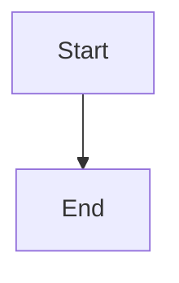
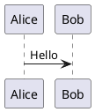

# Druckform

Convert Markdown with composable components into styled PDFs via LaTeX, using the `druck` CLI.

## Setup and updates

Run this preflight once at the start of a druckform task, before the first render.

1. **Is `druck` available?** Run `command -v druck`.
   - If `DRUCK_BIN` is set, use that binary (a local or custom build, with no npm version to track) and skip the rest of this section.
   - If `druck` is present, go to step 2.
   - If `druck` is missing, install it, then go straight to the workflow (a fresh install is already current, so skip step 2):
     ```bash
     node -v                          # must be >= 22; have the user upgrade Node first if not
     npm install -g @druckform/core
     ```
     The CLI relays rendering to Docker automatically, so the LaTeX toolchain need not be installed. If the global install fails with `EACCES`, the user's npm needs a writable global prefix or a version manager (nvm/fnm); surface that instead of using `sudo`.
2. **Is it up to date?** (only when `druck` was already installed) Run:
   ```bash
   npm outdated -g @druckform/core
   ```
   A row (a `Latest` newer than `Current`) means an update exists: tell the user both versions and offer to run `npm install -g @druckform/core@latest`. Do not update without asking. No output means it is current. If the command errors (offline, registry unreachable), skip the check and proceed. Updating the CLI also updates the Docker image tag it renders with, so no separate step is needed.

## CLI Commands

| Command | Required flags | Optional flags | Output |
|---------|----------------|-----------------|--------|
| `druck templates` | — | `--json` | list of available templates |
| `druck components -t <template>` | `--template/-t` | `--json` | resolved components for a template (name, description, params, `acceptsChildren`, `example`, `source`, `acceptsElement`, `form`, `contractVersion`) |
| `druck lint --in <md>` | `--in` | `--template/-t` (else from frontmatter), `--style`, `--json` | `LintContract` — validates without rendering |
| `druck doctor -t <template>` | `--template/-t` | `--json` | `LintContract` — validates a template's components (exports, slot/param consistency, token coverage); no document or style needed |
| `druck render` | `--in`, `--out` | `--template/-t`, `--style`, `--assets` (default `.`), `--engine`, `--json` | `RenderContract` + PDF on disk |
| `druck preview-component` | `--template/-t`, `--name`, `--out` | `--params` (JSON), `--children`, `--style`, `--watch`, `--engine`, `--json` | `RenderContract` + PDF on disk — fast one-component preview |
| `druck new component --template <t> --name <n>` | `--name`, `--template` | `--format ts\|yaml`, `--accepts-children` | scaffolds component boilerplate |
| `druck new template --name <n>` | `--name` | `--extends` | scaffolds a `template.yaml` |

**`lint` vs `doctor`:** `lint` validates a *document* (`--in`) against a template. `doctor` validates a *template's components* (`--template/-t`) with no document or style. Author components against `doctor`; run `lint` before rendering a document.

**Component authoring:** for authoring components or templates, invoke the `druckform-authoring` skill — it encodes the full component/template contract, the scaffold → doctor → preview loop, and the examples gallery.

## Workflow

1. **Discover** — `druck templates` (list templates), then `druck components -t <template> --json`. Read every component's `example` field to understand syntax and required params.

2. **Write the document** — a Markdown file with optional YAML frontmatter and `:::` component fences (see Document Format below). Put any images/diagram skins in an assets directory.

3. **Validate (cheap, recommended)**:
   ```bash
   druck lint --template report --in document.md --style style.yaml
   ```
   Fix any findings before rendering.

4. **Render**:
   ```bash
   druck render \
     --template report \
     --style   style.yaml \
     --in      document.md \
     --assets  ./assets \
     --out     out.pdf
   ```
   `--style` is optional if the template carries its own style — pass it only to override. `--template` is optional if the document's frontmatter declares `template:`.

That's the whole loop — `render` writes the PDF directly to `--out`; there is no separate upload/download step.

## Execution engines

`druck render` and `druck preview-component` pick where the render actually happens:

- `--engine local` — run with the tools on this machine (`tectonic`, `rsvg-convert`, `mmdc`, `java`).
- `--engine docker` — relay the same command into a Docker container (default image `ghcr.io/druckform/druckform:<cli-version>`; override with `DRUCK_DOCKER_IMAGE`).
- `--engine auto` (default) — probe for the four local tools; if all are present, run locally, otherwise relay to Docker automatically. The `DRUCK_ENGINE` environment variable sets the same choice (`local`/`docker`/`auto`) when `--engine` isn't passed.

In `auto` mode a boot report (which tools were found/missing and which engine was chosen) is printed to **stderr**, so `--json` output on stdout stays clean. When relaying to Docker, paths are mounted identically (same path inside the container as outside), so `--in`/`--out`/`--assets`/`--style` need no rewriting. This applies only to `render` and `preview-component` — all other commands (`templates`, `components`, `lint`, `doctor`, `new`) always run locally.

## Document Format

A document may begin with an optional `---` YAML frontmatter block, followed by standard Markdown plus component directives using `:::` fences:

```markdown
---
title: Q3 Review
author: A. Hacker
---

# Document Title

Normal Markdown: **bold**, *italic*, lists, tables, code blocks.

:::component-name{param="value" other-param="value"}
Children content (Markdown, may contain nested components)
:::
```

Frontmatter values are available to components (e.g. a title block). A template may declare which frontmatter fields it accepts (and which are required) — `druck lint` reports missing required fields.

Components can be nested:

```markdown
:::infobox{title="Outer"}
Text here.
:::infobox{title="Inner"}
Nested content.
:::
:::
```

Run `druck components -t <template>` to get each component's exact parameter names, types, required status, and a working example.

## Diagrams

Include Mermaid or PlantUML diagrams as fenced code blocks — they are pre-rendered to PDF automatically:

````markdown

````

````markdown

````

Place any `.puml` skin files in `assets/` and reference them in `style.yaml` via `diagrams.plantuml.skinRef`.

## Directory Layout

```
document.md       # the source document
style.yaml        # optional — overrides the template's own style
assets/           # optional
├── logo.png
└── skin.puml
```

## Style File (style.yaml)

```yaml
$schema: "style-v1"
tokens:
  colors:
    accent:    "#2E5AAC"   # hex only, #RRGGBB
    warning:   "#B26A00"
    infoboxBg: "#EEF3FB"
  fonts:
    main: "TeX Gyre Pagella"
    mono: "JetBrains Mono"
  spacing:
    blockGap: "0.8em"
diagrams:
  mermaid:  { theme: "neutral" }
  plantuml: { skinRef: "skin.puml" }  # path relative to assets/
```

All color values must be `#RRGGBB` (6 hex digits). The `tokens` block is required. `diagrams` is optional.

## Error Handling

`druck render`/`druck lint` exit non-zero and report findings on failure (or with `--json`, emit a `LintContract`/`RenderContract` with `ok: false` / `status: "error"`).

Each finding has `{ severity, component, message, line? }` — `line` is the source line in `document.md`.

Common errors:
- Missing required param → `druck lint` catches this before LaTeX runs
- Unknown component name → `druck lint` reports it as an error finding
- LaTeX compile failure → `druck render` returns findings attributed to source lines

Always run `druck lint` before `druck render` to catch authoring errors cheaply.
