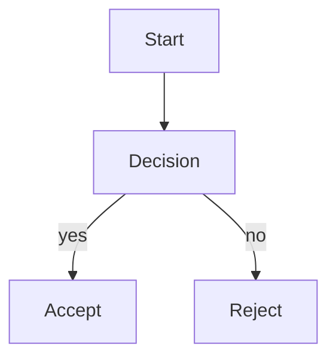
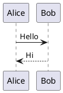

# Authoring guide

This guide covers everything you need to write and style druckform documents.

## Document format

A druckform document is a standard Markdown file (`.md`) with component **directives**, a syntax with three forms distinguished by colon count:

- **inline** `:name[content]{attrs}`: mid-sentence, must emit inline LaTeX
- **leaf** `::name[content]{attrs}`: single line, no nested body
- **container** `:::name{attrs}` … `:::`: a fenced block that can contain further Markdown/components

```markdown
# Document Title

Regular Markdown: **bold**, *italic*, `code`, > blockquotes, lists, tables.

:::component-name{param="value"}
Children content — also Markdown.
:::
```

See [Directive components](#directive-components) below for the full syntax and attribute model. Save the file as `document.md` at the root of your ZIP bundle.

## Component syntax

Container components are invoked with a `:::name{attrs}` opening fence, optional children, and a `:::` closing fence:

```markdown
:::infobox{title="Key Finding"}
The body of the info box supports **Markdown** and nested components.
:::
```

**Parameter rules:**
- Attributes live in `{...}`: `key="value"` (quoted), `key=value` (bare, no spaces), plus the shorthands `#id` and `.class`. See [Directive components](#directive-components).
- Required params: the CLI/MCP will report an error if missing.
- Optional params with defaults: omitting them uses the default from the template.

**Nesting:** components can be nested to any depth:

```markdown
:::infobox{title="Outer"}
Outer body.
:::infobox{title="Inner"}
Inner body.
:::
:::
```

To discover all components available for a template, run:

```bash
druck components --template base --json
```

or call the `list_components` MCP tool.

## Directive components

druckform components are invoked with **generic directives**, a Markdown convention with three forms, distinguished by how many colons open them:

| Form | Syntax | Use for |
|------|--------|---------|
| inline | `:name[content]{attrs}` | mid-sentence content (e.g. a badge); must emit inline LaTeX |
| leaf | `::name[content]{attrs}` | a single line, attributes-only, no nested body |
| container | `:::name{attrs}` … `:::` | a fenced block that can contain further Markdown/components |

A component declares which form it is via `meta.form: "inline" | "leaf" | "container"` (default `"container"` when omitted).

**Attribute model**: the `{...}` block accepts, space-separated:
- `#id`: sets an id; if given more than once, the **last one wins**.
- `.class`: adds a class; repeated `.class` tokens **combine** (space-joined).
- `key="value"` / `key='value'` / `key=value` (bare, no whitespace): an attribute; a bare `key` with no `=` is shorthand for `key="true"`.

```markdown
:::infobox{#note .highlight accent="warning"}
Shown with an id, a class, and a param.
:::
```

**Inline firing rule:** an inline directive only fires when `:` is immediately followed by a letter-initial name (`[A-Za-z][\w-]*`) *and* at least one of `[content]` / `{attrs}` follows immediately after the name. This is what keeps ordinary prose colons (`10:30`, `localhost:8080`) untouched: a bare `:word` with no bracket/brace never fires. To write a literal colon immediately before what would otherwise look like a directive name, escape it as `\:` (standard Markdown backslash-escaping: `:` is an escapable punctuation character, so the escaped colon is consumed as literal text and never reaches the directive rule). An inline/leaf/container name that isn't a registered component is an error (unregistered names do not silently pass through).

## Directive components: the `raw` escape hatch

`raw` is a reserved directive name that emits its body **verbatim** (unescaped) into the LaTeX output, for the rare case where you need LaTeX the component model can't express:

```markdown
:::raw{format=latex}
\clearpage
:::
```

It also works as a leaf or inline form: `::raw[...]{format=latex}`, `:raw[...]{format=latex}`. Only `format=latex` emits anything through druckform's LaTeX pipeline; `format=html` is reserved for a future Obsidian renderer and is silently skipped here.

## Portability

The directive syntax follows the CommonMark "generic directives" convention (the same one implemented by micromark/remark-directive), rather than a druckform-specific dialect. The intent is that the same `document.md` source can, in the future, also be opened and live-previewed by an Obsidian plugin implementing the same convention: that plugin is not part of druckform, but the document format is written to not preclude it.

## Built-in components

All of the components below ship in the **`base`** template, so every template that extends it (directly or transitively) has them. Run `druck components --template <name>` to see up-to-date parameter lists for your chosen template.

### `callout`

A variant-styled, titled box. Container form.

```markdown
:::callout{variant="warn" title="Heads up"}
Body
:::
```

| Param | Type | Required | Default | Description |
|-------|------|----------|---------|-------------|
| `title` | string | yes | none | Title shown in the header |
| `variant` | `info` \| `tip` \| `warn` \| `danger` | no | `info` | Visual style variant, each mapped to its own colour token |
| `accent` | token | no | (variant's token) | Style token name, overriding the variant's colour |

### `note` / `tip` / `warning` / `danger`

Friendly aliases for `callout` with the variant preset — `:::warning` is `callout` with `variant="warn"`, and so on (`note` → `info`, `tip` → `tip`, `danger` → `danger`). Same container form, still take `title` (required) and an optional `accent` override. The preset is only a *default*: the alias still exposes `variant`, and an explicit `variant` on the block wins over the preset — `:::note{variant="danger"}` really does render as a danger callout.

```markdown
:::warning{title="Heads up"}
Body
:::
```

### `infobox`

Back-compat alias of `callout` with `variant="info"`, kept for documents written before `callout` existed.

```markdown
:::infobox{title="Key Finding"}
Body text. **Markdown** is supported. Nested components are allowed.
:::
```

### `figure`

A captioned, numbered figure wrapping any block content (e.g. an image). Container form. Emits `\label{fig:<id>}` when `id` is given, so it can be targeted by `:ref`.

```markdown
:::figure{caption="System overview" id="arch"}

:::
```

| Param | Type | Required | Default | Description |
|-------|------|----------|---------|-------------|
| `caption` | string | yes | none | Figure caption |
| `id` | string | no | none | Anchor id; referenced as `:ref[<id>]` |

### `ref`

Inline cross-reference to a `figure` id.

```markdown
See :ref[arch] for the layout.
```

The bracketed content is the target id (`\ref{fig:arch}`); no `{...}` params.

### `pagebreak`

Forces a page break. Leaf form, no params.

```markdown
::pagebreak
```

### `pullquote`

Emphasised quotation, optionally attributed. Container form.

```markdown
:::pullquote{attribution="Ada Lovelace"}
The Analytical Engine weaves algebraic patterns.
:::
```

| Param | Type | Required | Default | Description |
|-------|------|----------|---------|-------------|
| `attribution` | string | no | `""` | Text shown after the quote |
| `accent` | token | no | `accent` | Style token name for the accent rule |

### `deflist`

A definition list of term/definition pairs. Leaf form — it is **not** a container; it does not take Markdown children.

```markdown
::deflist{pairs="Token=A named style value; Template=A named set of components"}
```

| Param | Type | Required | Default | Description |
|-------|------|----------|---------|-------------|
| `pairs` | string | yes | none | `;`-separated `Term=Definition` pairs |

### `metadata`

A two-column key/value block for document metadata. Leaf form.

```markdown
::metadata{pairs="Client=Acme GmbH; Date=2026-08-17; Status=Draft"}
```

| Param | Type | Required | Default | Description |
|-------|------|----------|---------|-------------|
| `pairs` | string | yes | none | `;`-separated `Key=Value` pairs |

### `badge`

An inline coloured label, e.g. a status marker.

```markdown
Status: :badge[DRAFT]
```

| Param | Type | Required | Default | Description |
|-------|------|----------|---------|-------------|
| `accent` | token | no | `accent` | Style token name for the label colour |

### `footnote`

An inline footnote; the bracketed content becomes the note text.

```markdown
The figure is provisional:footnote[Measured on 2026-08-17.].
```

No `{...}` params.

## `consulting` template components

The `consulting` template extends `base` (so it also has everything above) and adds a family for audit/assessment findings.

### `finding`

An audit finding: severity, an author-assigned id, a title, and a nested body (typically `impact`/`evidence`/`recommendation`). Container form.

```markdown
:::finding{severity="high" id="F-01" title="Secrets recoverable from CI logs"}
:::impact
Credentials are recoverable by anyone with read access.
:::
:::
```

| Param | Type | Required | Default | Description |
|-------|------|----------|---------|-------------|
| `severity` | `critical` \| `high` \| `medium` \| `low` | yes | none | Severity, each mapped to its own colour token (`severityCritical`/`severityHigh`/`severityMedium`/`severityLow`) |
| `id` | string | yes | none | Author-assigned identity, e.g. `F-01`. Findings keep the id the author assigns — inserting or removing a finding never renumbers the others, unlike a LaTeX counter. Referenced as `:ref[F-01]` (see [`extending-druckform.md`](extending-druckform.md#36-cross-references-figure--ref)); it renders the finding's id, not a page number |
| `title` | string | yes | none | Finding title |

The `impact`/`evidence`/`recommendation` sub-components below are meant to go inside a `:::finding` block, but nothing enforces that — each also renders standalone.

### `impact` / `evidence` / `recommendation`

The consequence, the evidence, and the remediation for a finding. Container form, no params; each renders its own labelled paragraph.

```markdown
:::impact
Credentials are recoverable by anyone with read access.
:::
```

```markdown
:::evidence
- `.github/workflows/deploy.yml:42` echoes `$DEPLOY_TOKEN`
:::
```

```markdown
:::recommendation
Mask the variable in CI and rotate the token.
:::
```

### `findings-summary`

A generated index of every `finding` in the document, with page numbers. Leaf form, no params.

```markdown
::findings-summary
```

`::findings-summary` may be placed before or after the findings it lists — it reads them back from a LaTeX auxiliary file rather than document order (`\@starttoc`/`\addcontentsline`, the same plain-LaTeX machinery behind `\listoffigures`). That also means it follows LaTeX's auxiliary-file contract: a `.fnd` left over in your own build directory from a previous run can show stale titles until the next render — the same property the table of contents has. Tectonic reruns automatically when that file changes, so a normal `druck render` already resolves it.

Use exactly one `::findings-summary` per document. LaTeX reads the auxiliary file and truncates it in the same step, so a second one renders its heading with an empty list rather than reporting an error.

### `exec-summary`

A headed, full-width executive summary — body prose, not a boxed aside. Container form.

```markdown
:::exec-summary
The engagement identified three issues, one of them high severity.
:::
```

| Param | Type | Required | Default | Description |
|-------|------|----------|---------|-------------|
| `title` | string | no | `"Executive Summary"` | Heading text |
| `accent` | token | no | `accent` | Style token name for the rule under the heading |

### `appendix`

Switches subsequent headings to lettered appendix sections (`\appendix`). Leaf form, no params.

```markdown
::appendix
```

`\appendix` on its own emits no visible mark on the page, so `druck preview-component` cannot render it standalone (the same known limitation applies to `pagebreak`); it renders fine as part of a real document.

## Cover page, title block and TOC

`base`'s `document` shell reads these optional `base` frontmatter fields (all strings; the parser coerces `toc: true` etc. to `"true"`):

```yaml
---
title: Q3 Review
subtitle: Regional performance
author: A. Hacker
date: 2026-08-17
cover: "true"
toc: "true"
---
```

- `title` — renders a centered title block; omit it and no title block is rendered at all.
- `subtitle`, `author`, `date` — each renders an extra line under the title, only if `title` is also set.
- `cover: "true"` — puts the title block on its own page (vertically centered, `\clearpage` after). Without it, the title block runs inline at the top of page one.
- `toc: "true"` — inserts `\tableofcontents` (and a page break) right after the title block.

## Diagrams

Embed Mermaid and PlantUML diagrams as fenced code blocks. They are pre-rendered to PDF automatically.

**Mermaid:**

````markdown

```mermaid
graph TD
  A[Start] --> B[Decision]
  B -->|yes| C[Accept]
  B -->|no| D[Reject]
```
````

**PlantUML:**

````markdown

```plantuml
@startuml
Alice -> Bob : Hello
Bob --> Alice : Hi
@enduml
```
````

Place `.puml` skin files in the `assets/` folder and reference them in your style file via `diagrams.plantuml.skinRef`.

## Templates

Templates define which components are available. Use `druck templates --json` to list all:

| Name | Extends | Description |
|------|---------|-------------|
| `base` | none | Foundational components for all documents |
| `report` | `base` | Extends base; defaults `infobox`'s accent to the `warning` token |
| `consulting` | `base` | Client-facing reports and assessments: `finding` with severity, plus `impact`/`evidence`/`recommendation`, `findings-summary`, `exec-summary`, `appendix` |

The `report` template inherits all components from `base` and adds or overrides its own. Template extensions are transitive.

## Style file

Every document needs a style YAML file included in the ZIP bundle. Create `style.yaml`:

```yaml
$schema: "style-v1"
tokens:
  colors:
    accent:    "#2E5AAC"   # primary accent (borders, headers)
    warning:   "#B26A00"   # warning callouts
    infoboxBg: "#EEF3FB"   # info box background
  fonts:
    main: "TeX Gyre Pagella"   # body font (must be a TeX Gyre or system font)
    mono: "JetBrains Mono"     # monospace font
  spacing:
    blockGap: "0.8em"          # vertical gap between blocks
  page:
    size: a4                   # a4 | letter — default a4
    margin: "2.5cm"            # applied to all four sides unless overridden below
    # top: "3cm"                # per-side overrides; each is optional
    # bottom: "3cm"
    # left: "2cm"
    # right: "2cm"
diagrams:
  mermaid:
    theme: "neutral"           # mermaid theme name
  plantuml:
    skinRef: "skin.puml"       # relative to assets/
```

**Token rules:**
- All color values must be `#RRGGBB` (exactly 6 hex digits, # prefix).
- `fonts.main` and `fonts.mono` must be fonts available in the Docker image. The bundled image includes TeX Gyre fonts and common system fonts.
- All `tokens.*` sub-blocks are optional; the render engine applies defaults for missing tokens.
- Additional token names (e.g. `infoboxBg`) are only meaningful if a component reads them via the style schema.
- The `diagrams` block is entirely optional.
- There is no `fonts.sans` / `\setsansfont`: only `fonts.main` (→ `\setmainfont`) and `fonts.mono` (→ `\setmonofont`) are supported.
- A font can also be `{ name, options }` instead of a bare string, e.g. `main: { name: "Noto Sans", options: "AutoFakeBold=2.2" }`, useful for variable fonts where `\bfseries` would otherwise render as Regular weight. See `docs/extending-druckform.md` §4.1 for details.
- `page.size` is `a4` or `letter`, default **a4**. `page.margin` sets all four margins at once; the per-side `page.top`/`page.bottom`/`page.left`/`page.right` override it individually. All `page` fields are optional. This compiles to `\geometry{…}`, applied after the engine loads `geometry` bare — a custom document shell must call `\geometry{...}` too, never `\usepackage[...]{geometry}` (that raises LaTeX's "Option clash").

## Bundle layout

The ZIP you upload (via `PUT <upload_url>` or `druck render`) must follow this structure:

```
bundle.zip
├── document.md       # required
├── style.yaml        # required (or whatever path you pass as `style`)
└── assets/           # optional — images, PlantUML skins, etc.
    ├── logo.png
    └── skin.puml
```

The `style` argument to `render_document` (MCP) or `--style` flag (CLI) is the path to the YAML file within the bundle, relative to the ZIP root.

**Assemble and upload the bundle:**

```bash
mkdir /tmp/df-bundle
cp document.md style.yaml /tmp/df-bundle/
cp -r assets/ /tmp/df-bundle/assets/ 2>/dev/null || true
cd /tmp/df-bundle && zip -r /tmp/bundle.zip .
curl -X PUT -H "Content-Type: application/octet-stream" \
  --data-binary @/tmp/bundle.zip \
  "<upload_url from render_document>"
```

## Validate before rendering

Run a lint pass to catch authoring errors before triggering the LaTeX pipeline:

```bash
druck lint --template base --in document.md --style style.yaml --json
```

A `findings` array with `severity: "error"` means the document will fail to render. Warnings are informational.

Via MCP: call `validate_document(job_id)` after uploading the bundle and before calling `finalize_job`.
