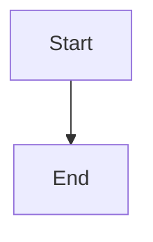
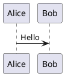

# Druckform — Developer & Extension Guide

> Convert Markdown (+ composable components) into styled PDFs via LaTeX.
> This guide covers the full developer surface: the MCP workflow, the CLI, and how to author **styles**, **components**, and **templates** — including how to override built-in behavior.

---

## 0. Mental model

```
document.md ──► parse ──► AST ──► compose ──► document.tex ──► tectonic ──► out.pdf
   (+ ::: fences)                    ▲   ▲
                                     │   └── style.yaml  → LaTeX preamble (colors/fonts/spacing)
                                     └────── template    → components that render AST nodes
```

Two distribution surfaces, same core engine:

| Surface | Binary | Use it when |
|---------|--------|-------------|
| **CLI** | `druck` | Local rendering, scripting, CI, authoring/debugging templates |
| **MCP server** | `druckform-mcp` (via `druck mcp`) | Claude Code / agents render through a job + upload/download HTTP flow |

The render pipeline (CLI `render` and MCP `finalize_job` both call the same `renderDocument`):
1. Resolve template (walk the `extends` chain, merge components).
2. Load `style.yaml`, **check token coverage** (fails fast, before LaTeX).
3. Parse `document.md` into an AST.
4. Pre-render diagram fences (mermaid/plantuml → PDF images).
5. Compose `.tex`: preamble (packages + style + component preambles) + body.
6. Run `tectonic` (no shell-escape, `minted` is forbidden).
7. On LaTeX failure, map errors back to source lines via a source map.

---

## 1. Quick start (CLI)

```bash
# List templates and a template's components
druck templates
druck components --template base

# Validate before rendering (cheap; catches unknown components, missing params, missing tokens)
druck lint --template report --in document.md --style style.yaml

# Render to PDF
druck render \
  --template report \
  --style   style.yaml \
  --in      document.md \
  --assets  ./assets \
  --out     out.pdf
```

### CLI reference

| Command | Required flags | Optional flags | Output |
|---------|---------------|----------------|--------|
| `druck templates` | — | `--json` | template list |
| `druck components` | `--template/-t` | `--json` | resolved components for a template |
| `druck lint` | `--in` | `--template/-t` (else from frontmatter), `--style`, `--json` | `LintContract` |
| `druck render` | `--in`, `--out` | `--template/-t` (else from frontmatter), `--style` (overrides template style), `--assets` (default `.`), `--json` | `RenderContract` + PDF on disk |
| `druck mcp` | — | — | starts the MCP server (spawns `druckform-mcp`) |

`--json` makes every command emit a stable machine-readable contract (see [§9](#9-contracts--types)). `render`/`lint` exit non-zero on findings.

> **Token check happens before LaTeX.** If a component declares `requiredTokens` your style doesn't provide, `render` exits with an error finding and never invokes tectonic. See [§4.4](#44-token-coverage-the-one-gotcha).

---

## 2. The MCP workflow

The MCP server exposes **5 tools**. Rendering is a job: create → upload a ZIP → (validate) → finalize → download.

| Tool | Input | Returns |
|------|-------|---------|
| `list_templates` | — | `{ schemaVersion, templates: [{ name, extends, origin, description? }] }` |
| `list_components` | `template: string` | `{ schemaVersion, template, components: [{ name, description, params, acceptsChildren, example? }] }` |
| `render_document` | `template: string, style: string` | `{ job_id, upload_url, download_url, expires_at, manifest_spec }` |
| `validate_document` | `job_id: string` | `{ schemaVersion, ok, findings }` |
| `finalize_job` | `job_id: string` | `{ status: "ok", download_url }` **or** `{ status: "error", error: { summary, findings } }` |

`style` is the **path of the style file inside the ZIP** (e.g. `"style.yaml"`, or `"styles/corporate.yaml"` if nested).

### 2.1 End-to-end

```bash
# 1) Discover (read each component's `example` to learn its syntax)
#    MCP: list_templates → list_components({ template: "report" })

# 2) Create the job
#    MCP: render_document({ template: "report", style: "style.yaml" })
#    → { job_id, upload_url, download_url, expires_at, manifest_spec }

# 3) Build and upload the ZIP bundle
mkdir -p /tmp/bundle/assets
cp document.md style.yaml /tmp/bundle/
cp -r assets/* /tmp/bundle/assets/ 2>/dev/null || true
( cd /tmp/bundle && zip -r /tmp/bundle.zip . )

curl -X PUT -H "Content-Type: application/octet-stream" \
  --data-binary @/tmp/bundle.zip \
  "<upload_url>"

# 4) Validate (recommended, cheap)
#    MCP: validate_document({ job_id })  → { ok, findings }
#    If ok=false: fix the document and start a NEW render_document job.

# 5) Finalize (runs the render pipeline)
#    MCP: finalize_job({ job_id })  → { status: "ok", download_url }

# 6) Download
curl -o out.pdf "<download_url>"
```

### 2.2 ZIP bundle layout

```
bundle.zip
├── document.md        # required, at zip root
├── style.yaml         # required; its path is the `style` arg to render_document
└── assets/            # optional — images, .puml skins, etc.
    ├── logo.png
    └── skin.puml
```

### 2.3 Limits & lifecycle (defaults)

| Thing | Default | Source of truth |
|-------|---------|-----------------|
| `upload_url` / `download_url` TTL | **15 min**, single-use | url tokens |
| Job TTL | **1 hour** (reaped every 5 min) | job store |
| Max upload size | **55 MB** | http server |
| Max uncompressed bundle | **50 MB**, **≤ 1000 entries** | hardened unzip (zip-slip protected) |
| Jobs dir | `/work/jobs` | `DRUCKFORM_JOBS_DIR` |
| Max concurrent jobs | `10` | `DRUCKFORM_MAX_JOBS` |

Job states: `pending → uploaded → rendering → done` (or `error`). `validate_document` and `finalize_job` both require the job to be in `uploaded` state (i.e. after a successful upload).

### 2.4 Error handling

`finalize_job` returns `{ status: "error", error: { summary, findings } }`. Each finding is `{ severity, component, message, line? }` where `line` points at `document.md`. Common cases:

- **Missing required param / unknown component** → caught by `validate_document` *before* LaTeX runs.
- **Missing style token** → caught by the pre-LaTeX token check.
- **LaTeX compile failure** → `finalize_job` findings, attributed to source lines via the source map.

Always `validate_document` before `finalize_job` to catch authoring errors cheaply.

---

## 3. Document format

Standard Markdown, plus component directives via `:::` fences.

### 3.1 Components in the document

```markdown
# Title

Normal Markdown: **bold**, *italic*, `code`, lists, tables, links.

::: infobox title="Note" accent="accent"
Body text — **may contain** nested Markdown and components.
:::
```

Components nest:

```markdown
::: infobox title="Outer"
Outer body.
::: infobox title="Inner"
Nested.
:::
:::
```

Parameter values are `key="value"` pairs on the fence line. Run `druck components -t <template>` (or `list_components`) to see each component's exact params, whether it `acceptsChildren`, and a working `example`.

### 3.2 GFM block elements

Full GitHub Flavored Markdown is rendered by built-in `block:*` components (see [§7](#7-built-in-block-elements-gfm)): headings, lists (incl. nested + task lists), tables with alignment, blockquotes, fenced code, images, links/autolinks, strikethrough, horizontal rules.

```markdown
## Heading

- [x] done
- [ ] todo

| Left | Center | Right |
|:-----|:------:|------:|
| a    | b      | c     |

> a blockquote

~~struck~~ and a [link](https://example.com).
```

### 3.3 Diagrams

Mermaid / PlantUML fenced code blocks are **pre-rendered to PDF images** before Markdown conversion (so they never hit `block:codeblock`):

````markdown

````

````markdown

````

PlantUML skins: put a `.puml` file in `assets/` and reference it from `style.yaml` via `diagrams.plantuml.skinRef`.

### 3.4 Frontmatter

A document may begin with a `---` YAML frontmatter block (it must be the very first line, with a closing `---`):

```markdown
---
template: report
title: Q3 Review
author: A. Hacker
---

# Heading
```

- **Template selection:** `template:` picks the template, so `--template` is optional. An explicit `--template`/`-t` arg **overrides** the frontmatter value.
- **Available to every component:** frontmatter values are exposed as `ctx.frontmatter.<key>` (TS components) and `{{fm.<key>}}` slots (declarative, escaped). The `document` shell is the usual consumer (title block / `\maketitle`).
- **Validated against the template's schema:** a template declares which fields it accepts (and which are required / their defaults):

```yaml
# template.yaml
frontmatter:
  title:  { required: true }
  author: { required: false }
  date:   { default: "n.d." }
```

`druck lint` reports missing required frontmatter; schema `default`s are applied before components see the values. The frontmatter schema **merges down the `extends` chain** (like style). Values are treated as strings.

```ts
// a TS component reading frontmatter
export const render: Component<typeof schema> = (_p, _c, ctx) =>
  ctx.frontmatter.title ? `\\title{${escapeTeX(ctx.frontmatter.title)}}\\maketitle` : "";
```

```yaml
# a declarative component reading frontmatter
emits: |
  \section*{{{fm.title}}}
```

---

## 4. Styles (`style.yaml`)

A style is **pure design tokens**. The compiler turns tokens into a LaTeX preamble; components reference tokens by name — they never hard-code colors.

### 4.1 Anatomy

```yaml
# yaml-language-server: $schema=../../schemas/style-v1.json
$schema: "style-v1"
tokens:
  colors:                       # name → #RRGGBB (6 hex digits only)
    accent:    "#2E5AAC"
    warning:   "#B26A00"
    infoboxBg: "#EEF3FB"
  fonts:
    main: "Liberation Serif"    # → \setmainfont  (needs the font installed)
    mono: "Liberation Mono"     # → \setmonofont
  spacing:                      # name → any CSS/TeX length
    blockGap: "0.8em"
diagrams:                       # optional
  mermaid:  { theme: "neutral" }
  plantuml: { skinRef: "skin.puml" }   # path relative to assets/
```

`tokens` is required. `diagrams` is optional. Colors must be `#RRGGBB`.

### 4.2 What each token compiles to

`compileStyle()` emits (token name is capitalized and prefixed with `druck`):

```latex
% colors  →  a color AND a convenience switch macro
\definecolor{druckAccent}{HTML}{2E5AAC}
\newcommand{\druckAccent}{\color{druckAccent}}

% fonts
\setmainfont{Liberation Serif}
\setmonofont{Liberation Mono}

% spacing  →  a length register
\newlength{\druckBlockGap}
\setlength{\druckBlockGap}{0.8em}
```

So token `accent` → color name **and** macro `\druckAccent`; token `blockGap` → length `\druckBlockGap`.

### 4.3 How components reference tokens

At render time components get a `RenderCtx`:

```ts
interface RenderCtx {
  token(name: string): string;   // "accent" → "\\druckAccent"  (the macro NAME)
  style: StyleTokens;            // raw values: { colors, fonts, spacing }
}
```

- TS component: `ctx.token("accent")` → the string `\druckAccent` to splice into LaTeX.
- Declarative component: a `token`-typed param's `{{slot}}` is replaced by `ctx.token(...)`.

### 4.4 Token coverage (the one gotcha)

A component can declare which tokens it needs (`requiredTokens`). Before LaTeX runs, druckform checks the style provides them, else it errors.

The set of "available" token names is built from your style as:

```
colors.*            → token names as-is        (e.g. "accent", "warning")
spacing.*           → token names as-is        (e.g. "blockGap")
fonts.main present  → "fontMain"   ⚠ NOT "main"
fonts.mono present  → "fontMono"   ⚠ NOT "mono"
```

⚠️ **Fonts are special:** to satisfy a `requiredTokens: ["fontMain"]`, your style must set `tokens.fonts.main`. There is no token literally named `main`.

### 4.5 Where style comes from (template style + optional override)

A template **carries its own style**. Declare it inline in `template.yaml`:

```yaml
# template.yaml
name: report
extends: base
style:
  tokens:
    colors:
      accent: "#B26A00"
```

Resolution, lowest → highest precedence:

```
base.style  →  …each template in the extends chain…  →  leaf.style  →  external --style (if any)
```

- Styles **merge down the `extends` chain** (per-token; child wins) — exactly like component defaults.
- The external `--style` file is now **optional**; when given, it merges on top of the template's style. Omit it and you get the template's own style.
- Token coverage (§4.4) runs against the **fully merged** effective style.

```bash
druck render -t report --in doc.md --out out.pdf            # template's style
druck render -t report --in doc.md --style brand.yaml --out out.pdf   # brand.yaml overrides
```

---

## 5. Creating a component

Two kinds. **Use declarative YAML** for simple "wrap children in an environment" components; **use TypeScript** when you need logic, enums, computed values, or asset handling.

A component file lives under a template's directory and is registered in that template's `template.yaml` `components:` map.

### 5.1 Declarative component (`*.component.yaml`)

Anatomy:

```yaml
name: infobox                    # component name used in ::: fences
description: "Boxed note with a title and optional body content."
params:
  title:  { type: string, required: true }
  accent: { type: token,  required: false, default: accent }   # token param
slots:
  children: true                 # set true to accept ::: body content
preamble: |                      # injected ONCE before \begin{document} (deduped)
  \newenvironment{infobox}[2]{%
    \par\vspace{0.5em}%
    \noindent{\leavevmode#1\bfseries#2}\par
    \noindent\rule{\linewidth}{0.5pt}\par\smallskip
    \noindent\ignorespaces
  }{%
    \par\vspace{0.5em}%
  }
emits: |                         # the LaTeX template with {{slots}}
  \begin{infobox}{{{accent}}}{{{title}}}
  {{children}}
  \end{infobox}
example: |
  ::: infobox title="Note"
  Body text, **may contain** nested blocks.
  :::
```

Interpolation rules for `emits`:

| Slot | Param type | Replaced with |
|------|-----------|---------------|
| `{{name}}` | `string` | the value, **escaped** via `escapeTeX` |
| `{{name}}` | `token` | `ctx.token(resolvedTokenName)` → a macro like `\druckAccent` (raw) |
| `{{children}}` | (slots.children) | the pre-rendered child LaTeX (raw) |

Notes:
- A `token` param defaults to its own name if no `default` is given, and **auto-adds that token to `requiredTokens`** (so coverage is checked).
- `{{accent}}` in the example resolves to `\druckAccent`; the triple-brace `{{{accent}}}` is just `{` + `{{accent}}` (a literal LaTeX brace around the macro).
- `string` params are always escaped — safe for arbitrary user input.

### 5.2 TypeScript component (`*.ts`)

A `.ts` component **must export** `schema`, `meta`, `render` (and optionally `preamble`). It is bundled with esbuild and imported at load time.

Real example (`templates/report/components/callout.ts`):

```ts
import { Tex, raw } from "druckform";
import type { Component, RenderCtx } from "druckform";
import { z } from "zod";

export const schema = z.object({
  variant: z.enum(["info", "warn", "danger"]).default("info"),
  title: z.string(),
});

export const meta = {
  name: "callout",
  description: "Variant-styled callout box with a title.",
  acceptsChildren: true,
  example: '::: callout variant="warn" title="Heads up"\nBody\n:::',
  requiredTokens: ["accent", "warning"],   // checked against the style
};

export const preamble = `\\newenvironment{callout}[2]{%
  \\par\\vspace{0.5em}%
  \\noindent{\\leavevmode#1\\bfseries#2}\\par
  \\noindent\\rule{\\linewidth}{0.5pt}\\par\\smallskip
  \\noindent\\ignorespaces
}{%
  \\par\\vspace{0.5em}%
}`;

export const render: Component<typeof schema> = (params, children, ctx: RenderCtx) => {
  const color = params.variant === "warn" ? ctx.token("warning") : ctx.token("accent");
  return Tex`\begin{callout}{${raw(color)}}{${params.title}}
${raw(children)}
\end{callout}`;
};
```

The render contract:

```ts
type Component<TSchema> = (
  params: TSchema["_output"],   // validated against `schema` before you get it
  children: string,             // pre-rendered child LaTeX (already escaped/processed)
  ctx: RenderCtx,
  element?: BlockElement,        // only set for built-in block:* components (see §7)
) => string;                    // return LaTeX
```

`meta` fields:

```ts
interface ComponentMeta {
  name: string;
  description: string;
  acceptsChildren: boolean;
  example?: string;
  requiredTokens?: string[];    // legacy — prefer tokenRef() (below); still honored & unioned
}
```

#### Declaring token params with `tokenRef` (preferred)

Instead of hand-maintaining `meta.requiredTokens` (which can drift from what you
actually read via `ctx.token()`), declare token params in the schema with `tokenRef`.
The loader **derives** `requiredTokens` from them, so there is a single source of truth:

```ts
import { z, tokenRef } from "druckform";   // tokenRef is exported from the package

export const schema = z.object({
  accent: tokenRef("accent"),   // validates as a string; marks "accent" as required
  title:  z.string(),
});
// no meta.requiredTokens needed — "accent" is derived from the schema and coverage-checked
```

`meta.requiredTokens` still works and is unioned with the derived set, so existing
components (like `callout` above) keep functioning unchanged.

### 5.3 Escaping & safety (read this before writing LaTeX)

`children` arrives **already processed**. Everything else you splice in is your responsibility. Import helpers from `druckform`:

```ts
import { escapeTeX, Tex, raw, RawTeX, resolveAssetPath } from "druckform";
```

| Helper | Use for |
|--------|---------|
| `escapeTeX(s)` | any raw user string going into LaTeX (escapes `& % _ # $ { } ~ ^ \`) |
| ``Tex`...${x}...` `` | tagged template that auto-escapes interpolations… |
| `raw(x)` / `RawTeX` | …wrap trusted LaTeX (token macros, `children`) so `Tex` does **not** escape it |
| `resolveAssetPath(root, ref)` | resolve an image/asset path; throws on absolute paths or `..` traversal |

Rules of thumb:
- **Never** put a user-supplied `params.*` string into LaTeX without `escapeTeX` (or via `Tex` without `raw`).
- **Do** wrap `children` and `ctx.token(...)` in `raw(...)` inside `Tex` (they're trusted/pre-rendered).
- Images: pass user refs through `resolveAssetPath(assetsRoot, ref)`.

### 5.4 Component preambles

Each component may export a `preamble` (LaTeX) injected **once** before `\begin{document}`. Identical preambles across components are **deduplicated** (set-based, trimmed). Put `\usepackage{...}` and environment/macro definitions here. (`minted` is forbidden — tectonic runs without shell-escape.)

### 5.5 Register the component

Add it to the owning template's `template.yaml`:

```yaml
components:
  callout:
    source: components/callout.ts          # .ts | .js | .mjs | .yaml | .yml
  infobox:
    source: components/infobox.component.yaml
```

The `source` path is **relative to the template's directory**.

---

## 6. Creating & overriding templates

### 6.1 `template.yaml` structure

```yaml
name: <string>                 # required — the template id used everywhere
description: <string>          # optional
extends: <templateName>        # optional — inherit another template's components
style:                         # optional — inline default style, merged down the chain (see §4.5)
  tokens: { colors: { accent: "#2E5AAC" } }
components:
  <componentName>:
    source: <path>             # full definition (new or full override)
    # OR
    extends: <parent>.<comp>   # partial override: keep parent source, only change defaults
    defaults:
      <param>: <value>         # default param values merged down the chain
```

### 6.2 Discovery: bundled vs user templates

```ts
loadAllTemplates(BUNDLED_TEMPLATES, process.env.DRUCKFORM_TEMPLATES_DIR)
```

- **Bundled**: shipped under the package's `templates/` dir (e.g. `base`, `report`).
- **User**: every immediate subdirectory of `$DRUCKFORM_TEMPLATES_DIR` that contains a `template.yaml`.

So to add your own templates without forking the package:

```bash
export DRUCKFORM_TEMPLATES_DIR=/path/to/my-templates
# /path/to/my-templates/acme/template.yaml
# /path/to/my-templates/acme/components/*.ts
druck templates           # → your `acme` template now appears
```

### 6.3 The `extends` chain

Templates linearize **root → leaf** (cycles are detected and rejected). Components merge as the chain is walked:

- `source:` present → **replaces** the parent's component entirely.
- `extends: parent.comp` + `defaults:` → **keeps the parent's source**, merges defaults (child wins).
- not mentioned → **inherited as-is**.

Real example — `report` extends `base`:

```yaml
# templates/report/template.yaml
name: report
description: "Report template — extends base with a variant-styled callout."
extends: base
components:
  infobox:                      # partial override: reuse base.infobox,
    extends: base.infobox       # just change its default accent token
    defaults:
      accent: warning
  callout:                      # brand-new component
    source: components/callout.ts
```

Result: `report` has everything in `base` (all `block:*`, `infobox`) plus `callout`, and its `infobox` defaults `accent` to `warning`.

### 6.4 Two ways to override

| Goal | Mechanism | Example |
|------|-----------|---------|
| Change only default params of an inherited component | `extends: parent.comp` + `defaults:` | `report`'s `infobox` |
| Replace a component's implementation | `source:` (new file, same name) | `fancy`'s `block:table` |
| **Remove** an inherited component | `<name>: null` (tombstone) | `infobox: null` |

Removing an inherited component:

```yaml
# template.yaml — drop base's infobox entirely from this template
extends: base
components:
  infobox: null
```

Components present in `base` but not mentioned by the child are inherited 1:1.
Nulling a built-in `block:*` component is **rejected at load time** — those are
required by the Markdown renderer.

Full-override example — `fancy` swaps how tables render:

```yaml
# template.yaml
name: fancy
description: "Test template overriding block:table"
extends: base
components:
  "block:table":
    source: components/block-table.ts
```

```ts
// components/block-table.ts  — replaces the default GFM table renderer
import { z } from "zod";
import type { BlockElement, RenderCtx } from "druckform";

export const schema = z.object({});
export const meta = { name: "block:table", description: "fancy table", acceptsChildren: false };

export function render(_p: unknown, _c: string, _ctx: RenderCtx, element?: BlockElement): string {
  if (!element || element.kind !== "table") return "";
  return `%FANCYTABLE rows=${element.rows.length}`;   // your own LaTeX here
}
```

Now any document rendered with `--template fancy` uses your table renderer; everything else falls through to `base`.

### 6.5 Overriding the document shell (page layout)

The whole LaTeX wrapper — document class, geometry, headers/footers, title block — is itself an overrideable component named **`document`** (reserved; shipped by `base`; not invocable from the document body). Override it like any component to control page layout.

A `document` override receives a typed `DocumentLayout` payload (the 4th render arg) and must mark where the body goes:

```ts
// components/document.ts  (registered as `document` in your template.yaml)
import { z } from "zod";
import type { BlockElement, DocumentLayout, RenderCtx } from "druckform";

export const schema = z.object({});
export const meta = { name: "document", description: "A4 + headers", acceptsChildren: true };

export function render(_p: unknown, _c: string, _ctx: RenderCtx, el?: BlockElement | DocumentLayout): string {
  if (!el || el.kind !== "document") return "DRUCKFORM_BODY";
  return [
    el.stylePreamble,          // compiled style (raw)
    el.componentPreamble,      // deduped component preambles (raw)
    "\\usepackage[a4paper,margin=2.5cm]{geometry}",
    "\\usepackage{fancyhdr}\\pagestyle{fancy}",
    "\\begin{document}",
    "DRUCKFORM_BODY",          // ← required: where the rendered body is spliced
    "\\end{document}",
  ].join("\n");
}
```

Declarative form — same slots, raw:

```yaml
name: document
params: {}
slots: { children: false }
emits: |
  {{stylePreamble}}
  {{componentPreamble}}
  \usepackage[a4paper,margin=2.5cm]{geometry}
  \begin{document}
  {{body}}
  \end{document}
```

**Engine-core split (important):** the composer always emits `\documentclass{…}` and the non-overridable engine packages — `fontspec`, `xcolor`, `graphicx`, `hyperref`, `ulem` — **before** your shell. These are output-correctness requirements (fonts, colors, images, links, strikethrough), so a custom `document` can't break them by omission. Your shell owns everything after: it **chooses** the documentclass value (via the payload / a param) but does **not** emit the literal `\documentclass` line, and it places the style/component preambles, page setup, title block, and the `DRUCKFORM_BODY` marker. A shell that omits the body marker is rejected at compose time.

---

## 7. Built-in block elements (GFM)

GFM block-level Markdown is rendered by built-in components in the **`base`** template under the reserved **`block:`** namespace. Because they're ordinary components, **any template can override them** through the `extends` chain (as in [§6.4](#64-two-ways-to-override)).

| Component | Renders | Default preamble |
|-----------|---------|------------------|
| `block:heading` | `#`…`######` → `\section`…`\subparagraph` | — |
| `block:list` | bullet / ordered / **task** lists | `amssymb` |
| `block:table` | GFM tables w/ alignment → `tabularx` + `booktabs` | `tabularx`, `booktabs`, `array` |
| `block:blockquote` | `>` → `quote` | — |
| `block:codeblock` | fenced code → `lstlisting` | `listings` |
| `block:image` | `` → `\includegraphics` | `adjustbox` |
| `block:hr` | `---` → `\rule` | — |

### 7.1 The `element` payload

Block components receive the 4th `render` arg, a typed `BlockElement`:

```ts
type BlockElement =
  | { kind: "table"; alignments: Array<"left"|"center"|"right"|null>;
      header: string[]; rows: string[][] }          // cells = pre-rendered inline LaTeX
  | { kind: "codeblock"; language: string | null; code: string }
  | { kind: "list"; ordered: boolean; start: number | null;
      items: Array<{ content: string; task: "checked" | "unchecked" | null }> }
  | { kind: "heading"; level: number }              // text comes via `children`
  | { kind: "blockquote" }                          // content via `children`
  | { kind: "image"; src: string; alt: string; title: string | null }  // src already resolved
  | { kind: "hr" };
```

Pattern for a block override — guard on `kind`, fall back gracefully:

```ts
export function render(_p, children, _ctx, element?: BlockElement): string {
  if (!element || element.kind !== "heading") return children;
  const cmd = ["section","subsection","subsubsection","paragraph","subparagraph","subparagraph"][element.level - 1] ?? "paragraph";
  return `\\${cmd}{${children}}`;
}
```

### 7.2 Reserved namespace rules

- User templates **may override** the seven known `block:*` names.
- User templates **may not invent** new `block:*` names — loading throws:
  `… uses the reserved 'block:' namespace for unknown component 'block:foo'`.
- Need a new block-ish component? Give it an ordinary name (no `block:` prefix) and use it via a `:::` fence.

---

## 8. Worked example: a custom template end-to-end

```bash
mkdir -p ~/druck-templates/acme/components
export DRUCKFORM_TEMPLATES_DIR=~/druck-templates
```

`~/druck-templates/acme/template.yaml`:

```yaml
name: acme
description: "ACME house style."
extends: base
style:                      # inline house style, merged over base (see §4.5)
  tokens:
    colors: { accent: "#0A7" }
components:
  "block:table":            # override GFM tables with a branded look
    source: components/block-table.ts
  banner:                   # add a new component used via ::: banner
    source: components/banner.component.yaml
```

`~/druck-templates/acme/components/banner.component.yaml`:

```yaml
name: banner
description: "Full-width title banner."
params:
  title: { type: string, required: true }
  bg:    { type: token,  required: false, default: accent }
slots:
  children: false
preamble: |
  \usepackage{tcolorbox}
emits: |
  \begin{tcolorbox}[colback=,colframe=,title={{title}}]\end{tcolorbox}
```

Lint and render — no `--style` needed (the template carries its own; pass `--style` only to override):

```bash
druck lint   -t acme --in doc.md
druck render -t acme --in doc.md --out acme.pdf
druck render -t acme --in doc.md --style client-brand.yaml --out acme.pdf   # optional override
```

(Remember: a `token`-typed param like `bg: accent` makes `accent` a *required* token — the effective style must define `colors.accent`.)

---

## 9. Contracts & types

All `--json` / MCP outputs share `schemaVersion: "1"`.

```ts
interface Finding { severity: "error" | "warning"; component: string; message: string; line?: number; }

interface TemplatesContract  { schemaVersion: "1"; templates: Array<{ name; extends: string|null; origin: "bundled"|"user"; description? }>; }
interface ComponentsContract { schemaVersion: "1"; template: string; components: Array<{ name; description; params; acceptsChildren; example? }>; }
interface LintContract       { schemaVersion: "1"; ok: boolean; findings: Finding[]; }
interface RenderContract     { schemaVersion: "1"; status: "ok"|"error"; pdf: string|null; error?: { summary; findings: Finding[] }; }
```

SDK surface importable from `druckform` (for TS components):

```ts
// values
import { escapeTeX, Tex, raw, RawTeX, resolveAssetPath } from "druckform";
// types
import type {
  Component, ComponentDef, ComponentMeta, RenderCtx, BlockElement,
  StyleConfig, StyleTokens, Finding,
  ResolvedTemplate, LintContract, RenderContract, TemplatesContract, ComponentsContract,
} from "druckform";
```

---

## 10. Reference

### Environment variables

| Var | Default | Purpose |
|-----|---------|---------|
| `DRUCKFORM_TEMPLATES_DIR` | — | extra dir scanned for **user** templates |
| `DRUCKFORM_JOBS_DIR` | `/work/jobs` | MCP job working dirs |
| `DRUCKFORM_MAX_JOBS` | `10` | MCP max concurrent jobs |
| `DRUCKFORM_HTTP_PORT` | `0` (OS-assigned ephemeral) | MCP HTTP port. Default `0` gives each instance its own free port (no clashes between concurrent Claude instances). Set a fixed value only when you need determinism (CI, docker port mapping). |
| `DRUCKFORM_HTTP_BIND` | `0.0.0.0` | MCP HTTP bind host |

### Token → LaTeX mapping

| Style key | LaTeX | Required-token name |
|-----------|-------|---------------------|
| `colors.<name>` | `\definecolor{druck<Name>}` + `\druck<Name>` switch | `<name>` |
| `fonts.main` | `\setmainfont{...}` | `fontMain` |
| `fonts.mono` | `\setmonofont{...}` | `fontMono` |
| `spacing.<name>` | `\newlength{\druck<Name>}` + `\setlength` | `<name>` |

### Preamble assembly order (the generated `.tex`)

```
\documentclass{article}
\usepackage{fontspec}
\usepackage{xcolor}
\usepackage{graphicx}
\usepackage{hyperref}
\usepackage[normalem]{ulem}
<style preamble>            % from compileStyle(style.yaml)
<component preambles>       % deduped union of every used component's `preamble`
\begin{document}
<body>
\end{document}
```

### Common errors

| Symptom | Cause | Fix |
|---------|-------|-----|
| `Missing required style token 'X'` | component needs token `X` not in style | add it to `style.yaml` (fonts → `fontMain`/`fontMono`) |
| `Unknown component 'foo' at line N` | `::: foo` not in resolved template | check name / template / `extends` |
| `reserved 'block:' namespace … unknown component` | user template defined a non-builtin `block:*` | rename without the `block:` prefix |
| `Component X extends unknown parent` | `extends: base.X` but parent has no `X` | fix the `extends` target or add a `source` |
| LaTeX failure w/ source line | bad LaTeX from a component / missing package | add `\usepackage{...}` to the component `preamble` |
| garbled special chars in output | unescaped user string in a TS component | wrap in `escapeTeX(...)` or use `Tex` without `raw` |
```
