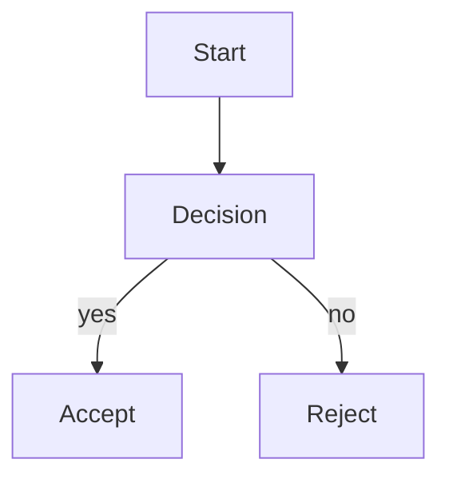
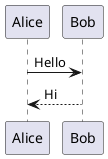

# E2E Bundled Template Report

Introduction paragraph with **bold**, *italic*, `code`, ~~strike~~ and a
[link](https://example.com). Ordinary prose colons must survive untouched:
the build starts at 10:30 and listens on localhost:8080.

:::infobox{title="Key Finding"}
Body of the info box, with **Markdown** inside.
:::

:::infobox{title="Outer Box"}
Outer body text.
:::infobox{title="Inner Box"}
Inner body text.
:::
:::

:::callout{variant="warn" title="Heads Up"}
A report-template callout in the warn variant.
:::

## GFM Elements

- bullet one
- bullet two
  - nested bullet

1. ordered first
2. ordered second

- [x] task done
- [ ] task open

> A blockquote paragraph.

| Left | Center | Right |
|:-----|:------:|------:|
| a    | b      | c     |
| d    | e      | f     |

```
plain & code block
```

---


## Diagrams





## Raw Escape Hatch

:::raw{format=latex}
\textbf{RawLatexMarker}
:::
